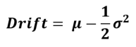
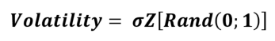
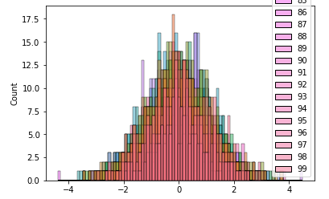
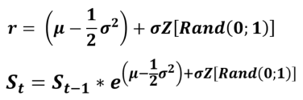
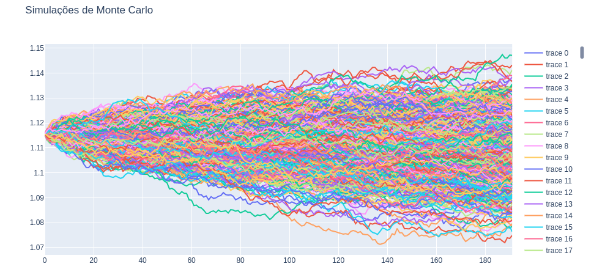
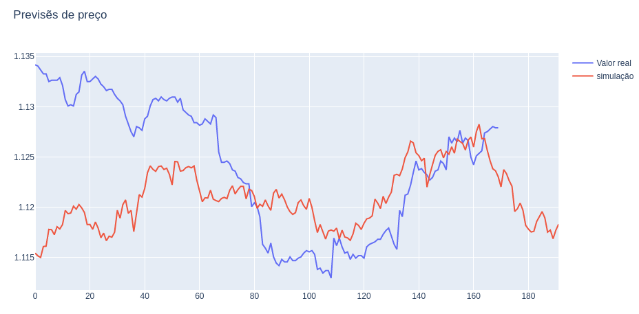

# Simulação de Monte Carlo

O método Monte Carlo começou a ser usado para avaliar integrais matemáticas complicadas. 
Hoje também pode ser usada para se fazer análise de mercado para investimentos.

## Calculo

### Drift
  
 
   Indica a direção que os valores tiveram no passado, é dada média menos 1 sobre 2 multiplicado pela variança ao quadrado.
  

### Volatility
  

   Variavel aleatoria : 
   calculo do desvio padrão(indica o quanto as taxas de retorno estão afastadas da média).
   É preciso criar uma matriz contendo de numeros aleatorios nume distribuição normal.
  
  

### Simulações

   Através da exponeciação de drift + o desvio padrão multiplicado na matriz de volatility obtemos uma matriz de simulações.
   No caso realizei 1.000 simulações buscando 192 posições no futuro:

# Escolhendo a melhor Simulação

   Para Encontrar a melhor simulação utilizo o calculo do erro médio absoluto, então seleciono a simulação com o menor erro.

  
